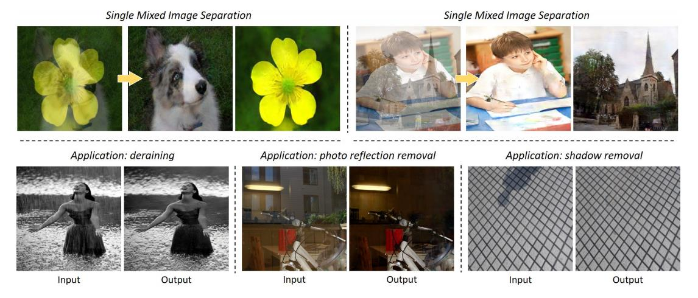
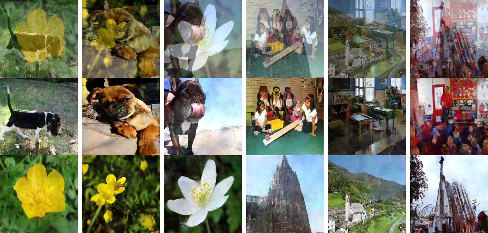
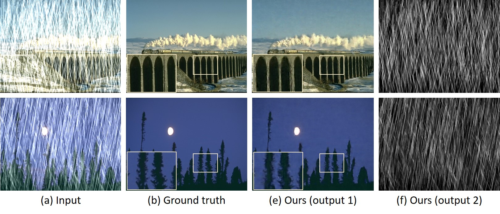
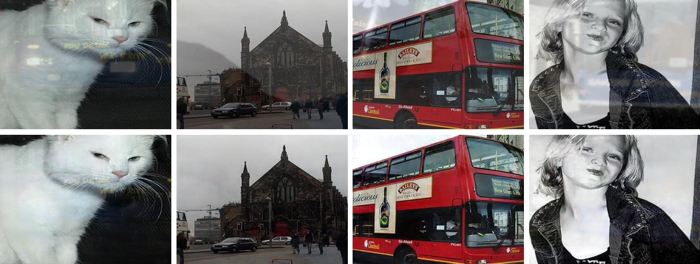
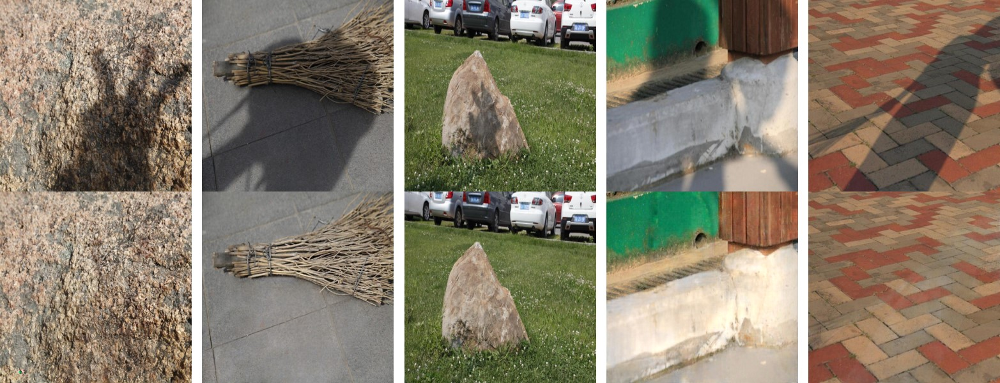

# Deep Adversarial Decomposition 

[PDF](<https://openaccess.thecvf.com/content_CVPR_2020/papers/Zou_Deep_Adversarial_Decomposition_A_Unified_Framework_for_Separating_Superimposed_Images_CVPR_2020_paper.pdf>) | [Supp](<https://openaccess.thecvf.com/content_CVPR_2020/supplemental/Zou_Deep_Adversarial_Decomposition_CVPR_2020_supplemental.pdf>) | [1min-DemoVideo](<http://www-personal.umich.edu/~zzhengxi/zzx_gallery/5946-1min.mp4>) 

### Pytorch implementation of the paper: "A Unified Framework for Separating Superimposed Images", in CVPR 2020.

In the computer vision field, many tasks can be considered as image layer mixture/separation problems. For example, when we take a picture on rainy days, the image obtained can be viewed as a mixture of two layers: a rain streak layer and a clean background layer. When we look through a transparent glass, we see a mixture of the scene beyond the glass and the scene reflected by the glass.

Separating individual image layers from a single mixed image has long been an important but challenging task. We propose a unified framework named “deep adversarial decomposition” for single superimposed image separation. Our method deals with both linear and non-linear mixtures under an adversarial training paradigm. Considering the layer separating ambiguity that given a single mixed input, there could be an infinite number of possible solutions, we introduce a “Separation-Critic” - a discriminative network which is trained to identify whether the output layers are well-separated and thus further improves the layer separation. We also introduce a “crossroad l1” loss function, which computes the distance between the unordered outputs and their references in a crossover manner so that the training can be well-instructed with pixel-wise supervision. Experimental results suggest that our method significantly outperforms other popular image separation frameworks. Without specific tuning, our method achieves the state of the art results on multiple computer vision tasks, including the image deraining, photo reflection removal, and image shadow removal. 



In this repository, we implement the training and testing of our method based on pytorch and also provide several demo datasets that can be used for reproduce the results reported in our paper. With the code, you can also try on your own dataset by following the instructions below.

Our code is partially adapted from the project [pytorch-CycleGAN-and-pix2pix](https://github.com/junyanz/pytorch-CycleGAN-and-pix2pix).


## Requirements

See [Requirements.txt](requirements.txt).


## Setup

1. Clone this repo:

```bash
git clone https://github.com/jiupinjia/Deep-adversarial-decomposition.git 
cd Deep-adversarial-decomposition
```

2. Download our demo datasets from 1) [Google Drive](https://drive.google.com/open?id=xxx); or 2) [BaiduYun](https://pan.baidu.com/xxxx) (Key: xxxx), and unzip into the repo directory.

```bash
unzip datasets.zip
```

   Please not that in each of our demo datasets, we only uploaded a very small part of the data, which are used to show the directory configurations of the datasets. To reproduce the results reported in our paper, you can download the full versions of these datasets. All datasets used in our experiments are publicly available. Please check out our [paper](https://openaccess.thecvf.com/content_CVPR_2020/papers/Zou_Deep_Adversarial_Decomposition_A_Unified_Framework_for_Separating_Superimposed_Images_CVPR_2020_paper.pdf) for more details.

   


## Task 1: Image unmix




#### On [Stanford-Dogs](https://people.csail.mit.edu/khosla/papers/fgvc2011.pdf) + [VGG-Flowers](http://www.robots.ox.ac.uk/~men/papers/nilsback_cvpr06.pdf)

- To train the model:

```bash
python train.py --dataset dogsflowers --net_G unet_128 --checkpoint_dir checkpoints --vis_dir val_out --max_num_epochs 200 --batch_size 2 --enable_d1d2 --enable_d3 --enable_synfake --output_auto_enhance
```

- To test the model:

```bash
python eval_unmix.py --dataset dogsflowers --ckptdir checkpoints --in_size 128 --net_G unet_128 --save_output
```

#### On MNIST + MNIST

- To train the model:

```bash
python train.py --dataset mnist --net_G unet_64 --checkpoint_dir checkpoints --vis_dir val_out --max_num_epochs 200 --batch_size 2 --enable_d1d2 --enable_d3 --enable_synfake --output_auto_enhance
```


## Task 2: Image deraining



#### On [Rain100H](https://arxiv.org/abs/1609.07769) 

- To train the model:

```bash
python train.py --dataset rain100h --checkpoint_dir checkpoints --vis_dir val_out --max_num_epochs 200 --batch_size 2 --enable_d1d2 --enable_d3 --enable_synfake --net_G unet_512 --pixel_loss pixel_loss --metric psnr_gt1
```

- To test the model:

```bash
python eval_derain.py --dataset rain100h --ckptdir checkpoints --net_G unet_512 --in_size 512 --save_output
```

#### On [Rain800](https://arxiv.org/abs/1701.05957) 

- To train the model:

```bash
python train.py --dataset rain800 --checkpoint_dir checkpoints --vis_dir val_out --max_num_epochs 200 --batch_size 2 --enable_d1d2 --enable_d3 --enable_synfake --net_G unet_512 --pixel_loss pixel_loss --metric psnr_gt1
```

- To test the model:

```bash
python eval_derain.py --dataset rain800 --ckptdir checkpoints --net_G unet_512 --in_size 512 --save_output
```

#### On [DID-MDN](https://openaccess.thecvf.com/content_cvpr_2018/papers/Zhang_Density-Aware_Single_Image_CVPR_2018_paper.pdf) 

- To train the model:

```bash
python train.py --dataset did-mdn --checkpoint_dir checkpoints --vis_dir val_out --max_num_epochs 200 --batch_size 2 --enable_d1d2 --enable_d3 --enable_synfake --net_G unet_512 --pixel_loss pixel_loss --metric psnr_gt1
```

- To test the model on [DID-MDN](https://openaccess.thecvf.com/content_cvpr_2018/papers/Zhang_Density-Aware_Single_Image_CVPR_2018_paper.pdf):

```bash
python eval_derain.py --dataset did-mdn-test1 --ckptdir checkpoints --net_G unet_512 --save_output
```

- To test the model on [DDN-1k](https://openaccess.thecvf.com/content_cvpr_2018/papers/Zhang_Density-Aware_Single_Image_CVPR_2018_paper.pdf):

```bash
python eval_derain.py --dataset did-mdn-test2 --ckptdir checkpoints --net_G unet_512 --in_size 512 --save_output
```


## Task 3: Image reflection removal



#### On [Synthesis-Reflection](https://openaccess.thecvf.com/content_CVPR_2019/papers/Wen_Single_Image_Reflection_Removal_Beyond_Linearity_CVPR_2019_paper.pdf) 

- To train the model (together on all three subsets [defocused, focused, ghosting]):

```bash
python train.py --dataset syn3-all --checkpoint_dir checkpoints --vis_dir val_out --max_num_epochs 200 --batch_size 2 --enable_d1d2 --enable_d3 --enable_synfake --net_G unet_512 --pixel_loss pixel_loss --metric psnr_gt1
```

- To test the model:

```bash
python eval_dereflection.py --dataset syn3-all --ckptdir checkpoints --net_G unet_512 --in_size 512 --save_output
```

   You can also train and test separately on the three subsets of [Synthesis-Reflection](https://openaccess.thecvf.com/content_CVPR_2019/papers/Wen_Single_Image_Reflection_Removal_Beyond_Linearity_CVPR_2019_paper.pdf) by specifying `--dataset` above to `syn3-defocused`, `syn3-focused`, or `syn3-ghosting`. 

#### On [BDN](https://openaccess.thecvf.com/content_ECCV_2018/papers/Jie_Yang_Seeing_Deeply_and_ECCV_2018_paper.pdf) 

- To train the model:

```bash
python train.py --dataset bdn --checkpoint_dir checkpoints --vis_dir val_out --max_num_epochs 200 --batch_size 2 --enable_d1d2 --enable_d3 --enable_synfake --net_G unet_256 --pixel_loss pixel_loss --metric psnr_gt1
```

- To test the model:

```bash
python eval_dereflection.py --dataset bdn --ckptdir checkpoints --net_G unet_256 --in_size 256 --save_output
```


#### On [Zhang's dataset](https://openaccess.thecvf.com/content_cvpr_2018/papers/Zhang_Single_Image_Reflection_CVPR_2018_paper.pdf) 

- To train the model:

```bash
python train.py --dataset xzhang --checkpoint_dir checkpoints --vis_dir val_out --max_num_epochs 200 --batch_size 2 --enable_d1d2 --enable_d3 --enable_synfake --net_G unet_512 --pixel_loss pixel_loss --metric psnr_gt1
```

- To test the model:

```bash
python eval_dereflection.py --dataset xzhang --ckptdir checkpoints --net_G unet_512 --in_size 512 --save_output
```


## Task 4: Shadow Removal



#### On [ISTD](https://openaccess.thecvf.com/content_cvpr_2018/papers/Wang_Stacked_Conditional_Generative_CVPR_2018_paper.pdf) 

- To train the model:

```bash
python train.py --dataset istd --checkpoint_dir checkpoints --vis_dir val_out --max_num_epochs 200 --batch_size 2 --enable_d1d2 --enable_d3 --enable_synfake --net_G unet_256 --pixel_loss pixel_loss --metric labrmse_gt1
```

- To test the model:

```bash
python eval_deshadow.py --dataset istd --ckptdir checkpoints --net_G unet_256 --in_size 256 --save_output
```


#### On [SRD](https://openaccess.thecvf.com/content_cvpr_2017/papers/Qu_DeshadowNet_A_Multi-Context_CVPR_2017_paper.pdf) 

- To train the model:

```bash
python train.py --dataset srd --checkpoint_dir checkpoints --vis_dir val_out --max_num_epochs 200 --batch_size 2 --enable_d1d2 --enable_d3 --enable_synfake --net_G unet_512 --pixel_loss pixel_loss --metric labrmse_gt1
```

- To test the model:

```bash
python eval_deshadow.py --dataset srd --ckptdir checkpoints --net_G unet_512 --in_size 512 --save_output
```


## Citation

If you use this code for your research, please cite our paper:

``````
@inproceedings{zou2020deep,
  title={Deep Adversarial Decomposition: A Unified Framework for Separating Superimposed Images},
  author={Zou, Zhengxia and Lei, Sen and Shi, Tianyang and Shi, Zhenwei and Ye, Jieping},
  booktitle={Proceedings of the IEEE/CVF Conference on Computer Vision and Pattern Recognition},
  pages={12806--12816},
  year={2020}
}
``````
